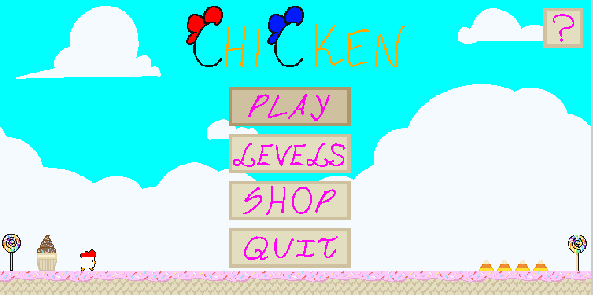
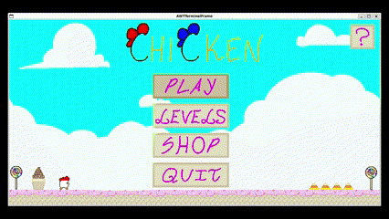
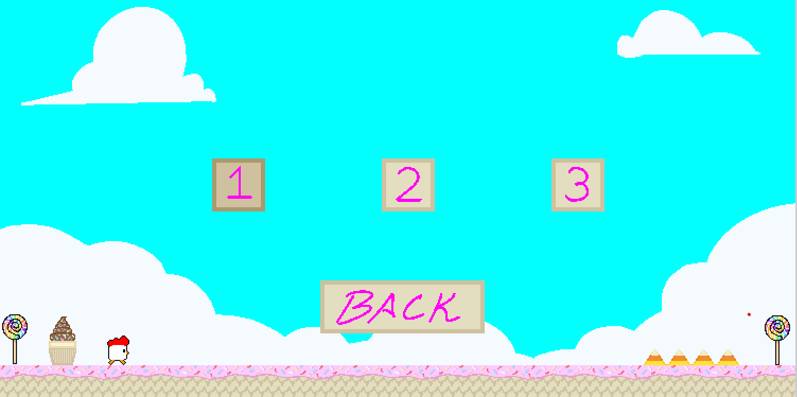
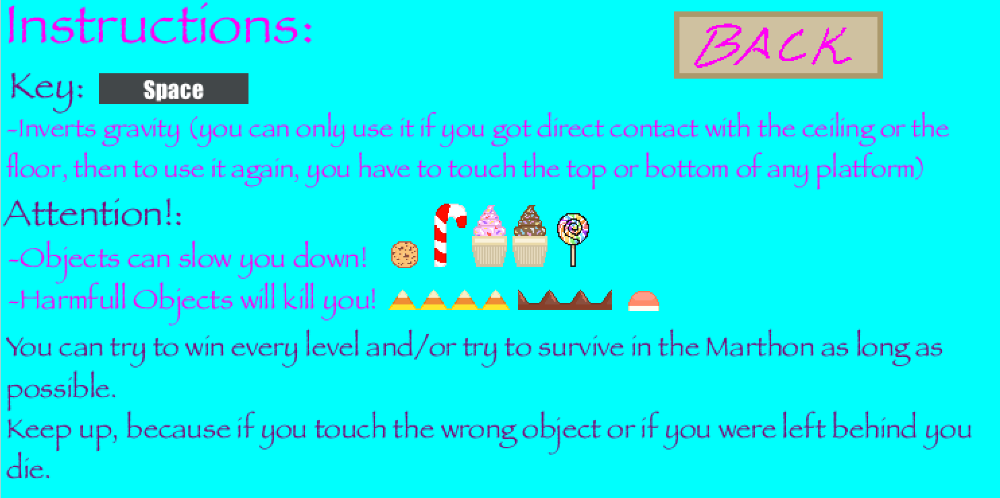
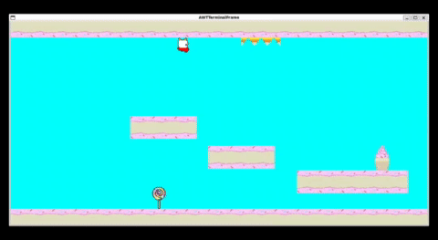

<h1 align="center">
    LDTS-2024-t09g03 
</h1>

    

### Game Concept
This Chicken Game is similar to the Gravity Guy game, it consists in a chicken that when the Space key is pressed it inverts its gravity and with that mechanic can dodge obstacles.

#### Controls

`>`|`<`|`^`|`˅`: Selects the Button

`Enter`: Presses the Selected Button

`Space`: Inverts chicken gravity

`Q`: Exits the game

### Screenshots

Its has a Main Menu from which the player can select one of the different menus, `Levels`,`Shop`,`Help`,`Play`.

#### In the Shop Menu the player can customise its skin.

    

#### In the Levels Menu the player can select the level it wants to play

    

#### In the Help Menu the player can see the game instructions

    

#### When the play button is pressed the player enters the Marathon game mode, a mode that never ends

    

# [Documentation](docs/README.md)

