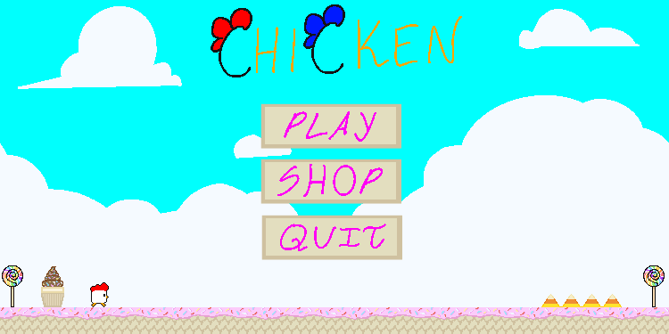
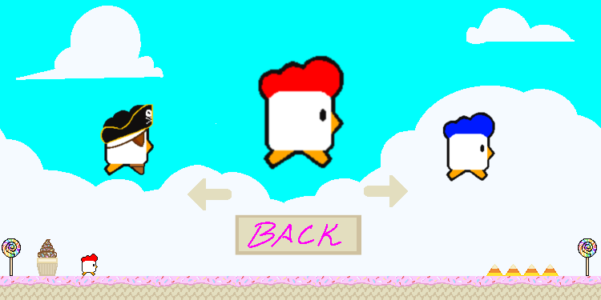
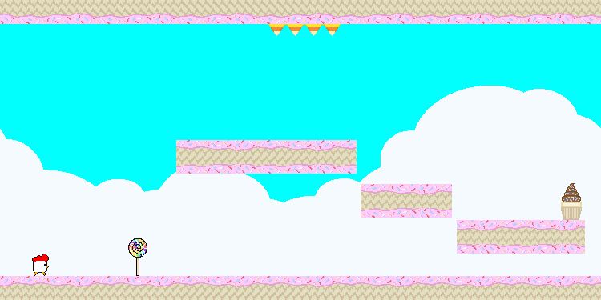
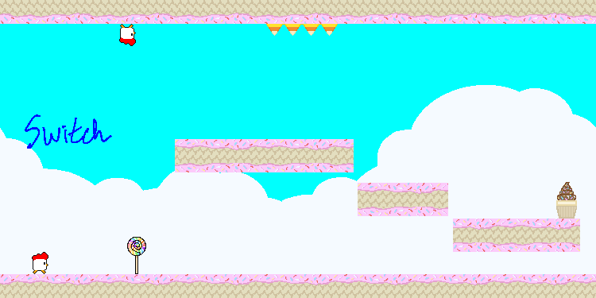
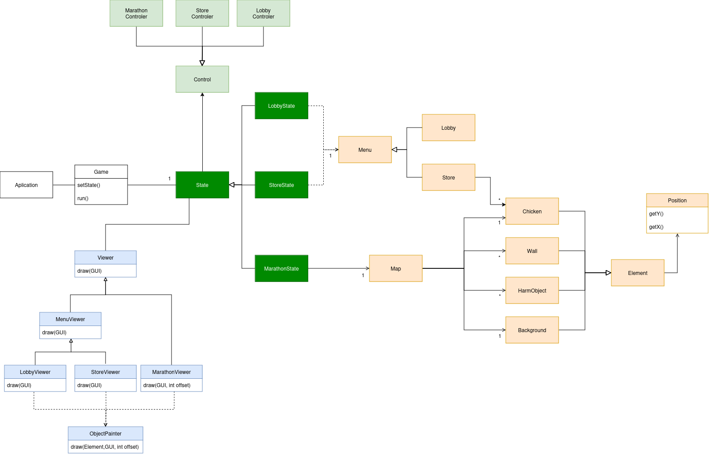

Description: 
In this game, you are able to control your own chicken through a map with different obstacles and platforms. In the main menu, you can choose to start the game right away or select your favourite chicken skin from the shop. During the gameplay, you have the ability to move your character up and down, in order to dodge any unwanted collision and avoid being killed or left behind. Use your strategy and coordinative skills to survive as long and as far as possible.

Features: •	Move up and down •	Skins •	Main Menu •	Shop Menu •	Game Over Menu •	Platforms •	Camera •	Infinite map •	Buttons •	Collisions with objects

mockup_lobby

mockup_shop

mockup_marathon

mockup_gravity_switch

Design Patterns, problems and consequences:

Since our game needed a map displayed at the start of the game, we decided to save the necessary information to initialise it through a file txt, in order to read and extract information from it. Because our game implements a structure with menus (such as lobby and store) and, at the same time, runs a game loop where the whole game happens, we need for the operations happening inside the Game class to be updated over time. To do that, we implemented the State Pattern, so that everything that is being executed is determined by State class. During the execution of our game, we need to update physics (gravity) without depending on the viewer, therefore we want to implement the Game Loop Pattern for that purpose. We decided to use the architectural pattern MVC (Model View Controller) in order to get a good separation between these three fields. That allows us to have greater flexibility when developing code and more proficient tests, resulting in a more stable and organized project.