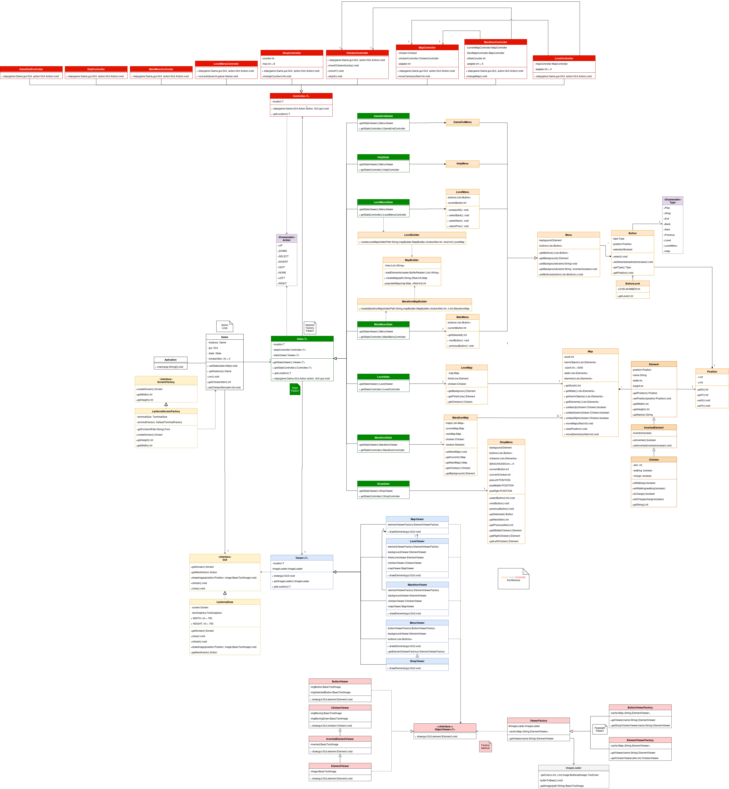
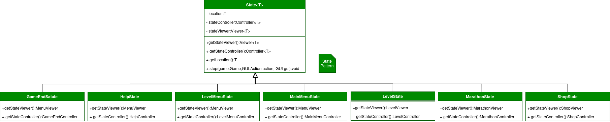
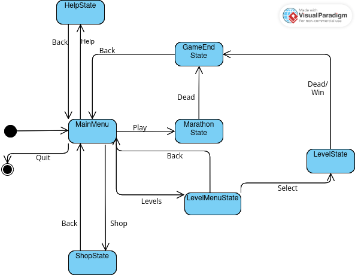
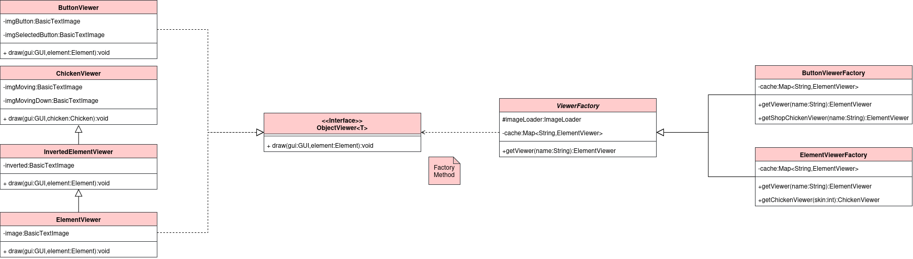
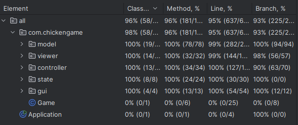
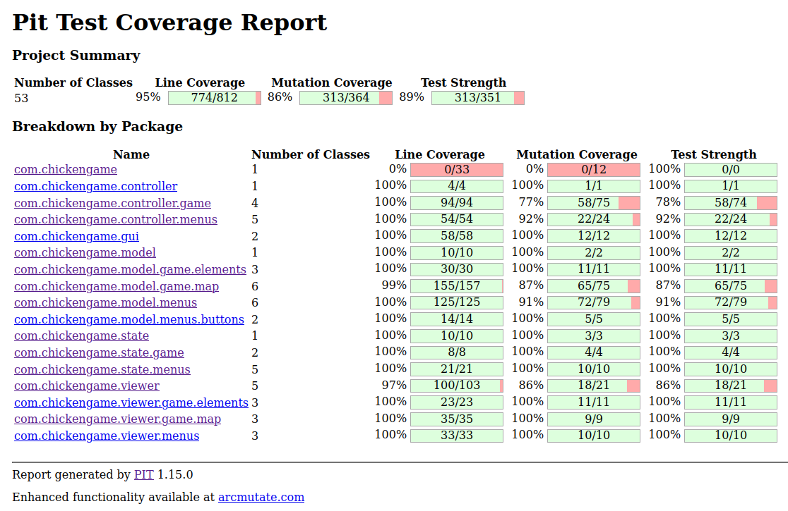

<h1 align=center>
LDTS-2024-t09g03
</h1>

  

# Authors

- Joana Louro [up202307040](https://github.com/joanalouro8)
- Luís Santos [up202306823](https://github.com/Dead4ever07)
- Teresa Santos [up202304113](https://github.com/TerryFS05)

# Index
- [Game Concept](#Game-Concept)
- [Features](#Features)
- [UML](#UML-Structure)
- [Design Choices](#design-choices)
  - [Game Loop](#game-loop)
  - [State Pattern](#state-pattern)
  - [Abstract Factory Pattern](#abstract-factory-pattern)
  - [ImageLoader](#imageloader)
  - [Factory Pattern](#factory-pattern)
  - [FlyWeight Pattern]()
- [Code Testing]()

#  Game Concept
The goal of the game is to survive during the most amount of time in marathon mode and to finish each level in level mode, for that the player can use the space key in order to invert the gravity. In order to make the game more challenging there we added spikes that makes one lose on touch and also added object that push the player behind in order to make it fall of the map.

# Features

- Move Up and Down
- Original Skins
- Main Menu
- Shop Menu
- Level Menu with 3 Levels
- Game Over Menu
- Win Menu
- Infinite Map
- Buttons
- ImageLoader
- Death Mechanics

## About Features
- Move Up and Down: The basic mechanic of the game that allows the player to invert gravity in order to dodge obstacles.

- Original Skins: There are 9 original skins from which the player can choose.

- Main Menu: A simple menu that appears when the game starts that allows the player to choose from `Play`, `Levels`, `Shop`, `Quit`,`?`.

- Shop Menu: This can be selected from the Main Menu. In the Shop, the player can choose their skin using the arrow keys (`Up`, `Down`, `Left`, `Right`) to select a button, and the Enter key to confirm the action or go back to the Main Menu.

- Level Menu: It has the same select mechanic as shop and the player can choose one of the 3 maps available.

- Game Over Menu: When the player looses it appears a menu so it is possible to go back to the Main Menu. 

- Win Menu: When the player wins it appears a menu so it is possible to go back to Main Menu, this can only been achieved in LevelMode

- Infinite Map: As the name suggests is infinite, it consists in 3 maps replayed in a random sequence in order to achieve the infinite perception. However you can try to survive as long as possible.

- Buttons: Buttons can be selected using the arrow keys and activated using the Enter key.

- ImageLoader: Since the game is heavily based on images and art created by the team, we have a class that reads PNG files and loads them into BasicTextImages, which are then drawn using Lanterna.

-Death Mechanics: There are two ways to die. Falling off the map, which can happen from any direction (Up, Down, or Back) or colliding with harmful objects (objects that can kill the player).

## UML Structure

  

## Design Choices
Design Choices
When projects reach a certain size, they need to be well-structured to keep the code readable and maintainable. Because of this, we chose to use the Model-View-Controller (MVC) architectural pattern to separate the visual and logical parts of our project.

The logic behind this pattern is:

- Model: Responsible for handling the game logic.
- View: Responsible for rendering the visual logic.
- Controller: Responsible for handling input logic.

In the beginning of our project, the pattern wasn't being followed strictly. However, once we reached a certain size, we felt the need to restructure the project to better adhere to the MVC pattern.
## Game Loop

To ensure the game runs without waiting for user input and without using threads to handle the input, we used the Game Loop Pattern. The Game Loop Pattern consists of a while loop that runs depending on the game state and keeps track of the time elapsed to ensure each iteration takes the same amount of time.
### Implementation Technicalities

In order to make the Game Loop run even though the user didn't press a button, we created an enum with the possible input events that contains the `None`action, int that case the the loop runs and every control class related to the state in which the program is, does what is supposed to do if no key has been pressed, it can be nothing or it can be move the map and chicken.

[Game Loop](https://gameprogrammingpatterns.com/game-loop.html)

## State Pattern
The problem that we faced was the existence of many menus, independent of each other, to solve that problem we implemented the State Pattern, that way we were able to isolate every State of the game and give it independence to implement each one its own game logic.

    

    

### Implementation Technicalities

In our implementation we have a abstract class [State](/src/main/java/com/chickengame/state/State.java) that contains a location T and based on the tipe of the template this State gets implemented by other classes.

## Abstract Factory Pattern

As previously mentioned in our game we have different states with different properties, to manage that problem we implemented the Abstract Factory Pattern.
The Abstract Factory is the State\<T\> class, that class has the basic logic, but then is extended so that we can create controllers and viewer based on the model given.

## ImageLoader
In our game we highly depends on images, and to properly and efficiently load those images in to memory so that they can be printed by Lanterna, to solve that problem we created a class to load images into memory. It does that by reading an image in a specific path and load it into BufferedImage, from that on, it creates an `BasicTextImage`(class provided by Lanterna library) with the same size and goes pixel by pixel to copying the color from the BufferedImage to the `BasicTextImage`.

[BasicTextImage](http://mabe02.github.io/lanterna/apidocs/3.0/com/googlecode/lanterna/graphics/BasicTextImage.html) 

### Development Progression

In our game development we first thought drawing pixel by pixel, and with the resolution that we have (750x375) it would be impossible to have any functional game with that strategy, the FPS where around 3, after that we tried to draw BasicTextImage and it worked well getting up to 50 fps in game play.
## Factory Pattern
While we were creating our game, we needed a way to draw each element on the screen, our first approach was to create an element viewer to each element that extends `Viewer<T>` that way we were able to draw elements like platforms and buttons, but soon the number of elements raised and so the necessity to solve our problem differently, it was then when we thought about the `Factory Pattern`. The Factory Pattern allowed us to create all the viewers that we wanted without having a class for each one.

### Implementation Technicalities

In our game we have an abstract class `ViewerFactory<T>` wich is the abstract creator of `ObjectViewer<T>` and interface that is implemented by our concrete viewer(ButtonViewer, ChickenViewer, InvertedElementViewer ,ElementViewer), and our Factory has two concrete extencions, the ButtonViewerFactory and the ElementViewerFactory.

  

## FlyWeight Pattern

While our game was being developed, we noticed that we were loading many images into memory and that most of those images were the same, to solve that problem we thought about the FlyWeight Pattern, by keeping a map of element names and their correspondent Viewer, we were able to load the image into memory only once and then if there was an element that needed to use that image again it would receive the same instance of viewer.

## Code Testing

### Code Test Coverage

**Testing tools used**
  - `JUnit`
  - `Mockito`
  - `Jqwik`
  - `Spock`

A significant part of our tests are PBT(Property Based Testing) because we think it is a great way of testing multiple combination of variables. 

 - Method Coverage: 96%
 - Branch Coverage: 93%

  

 - Line Coverage: 95%
 - Mutation Coverage: 86% 

  

